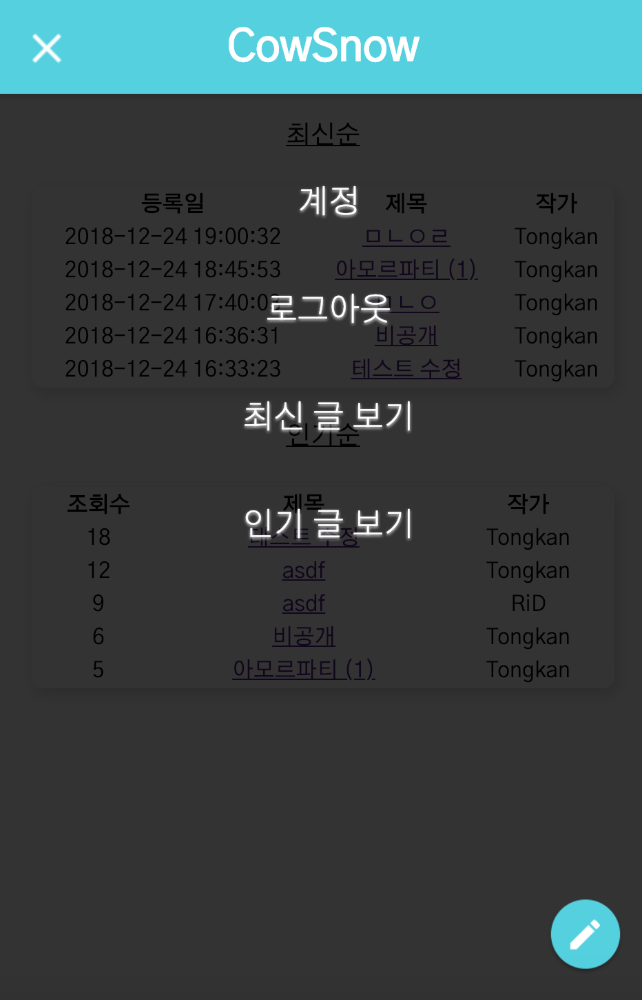
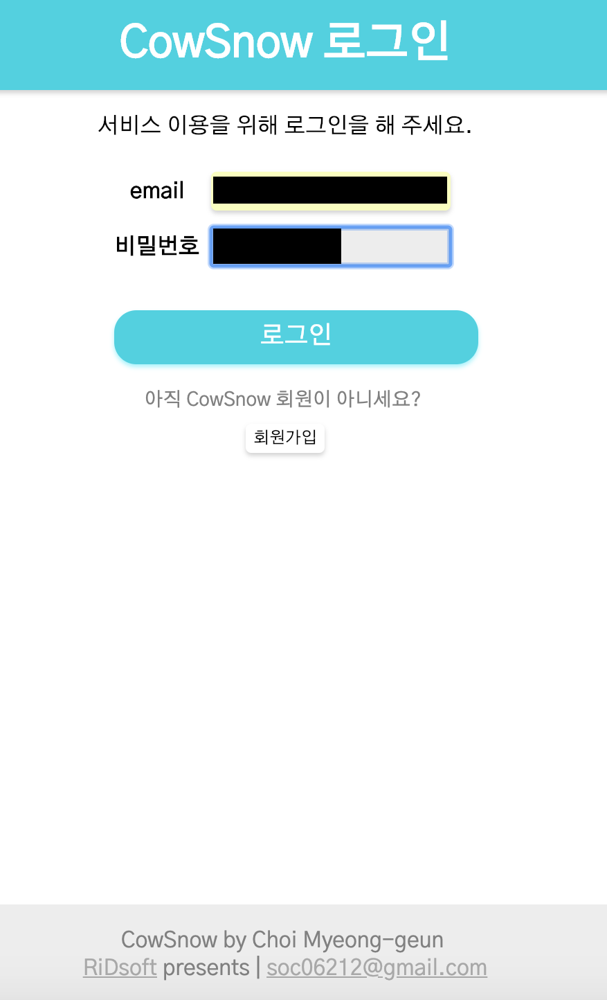
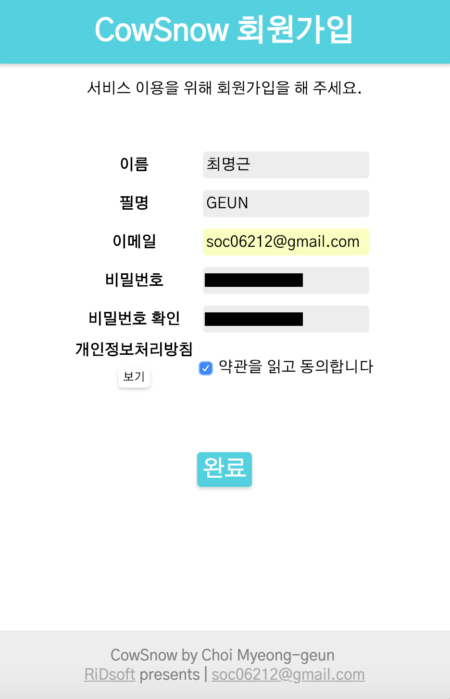
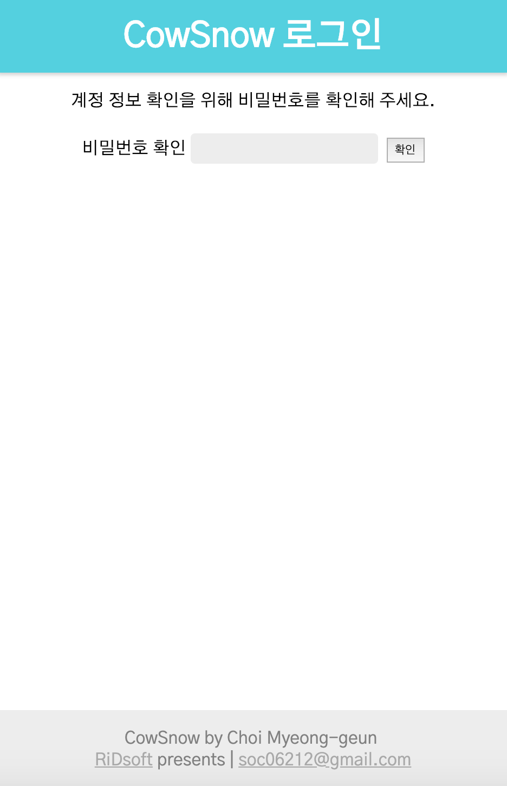
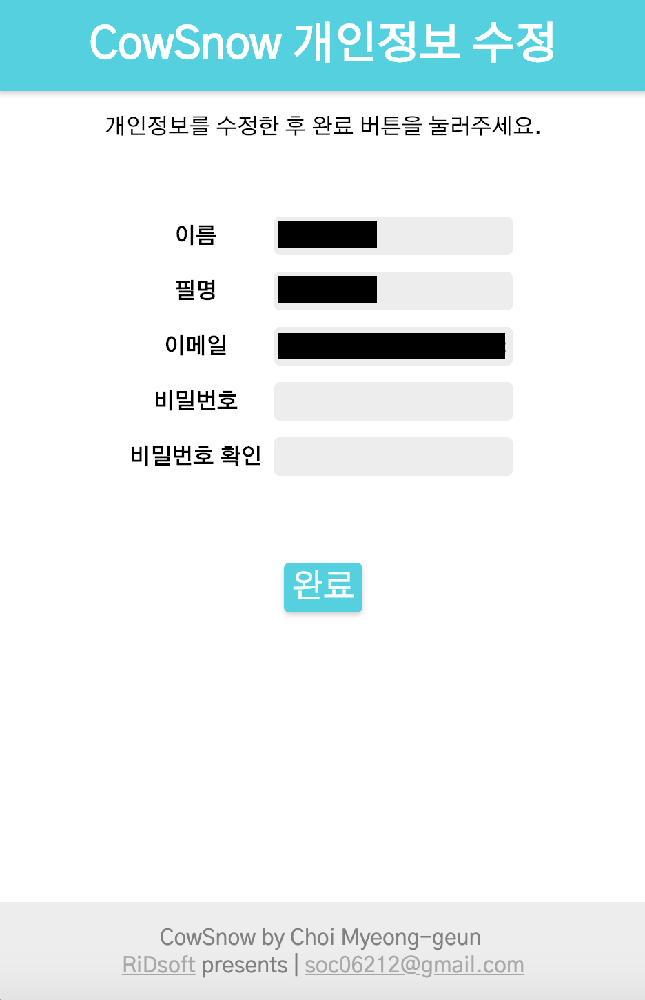
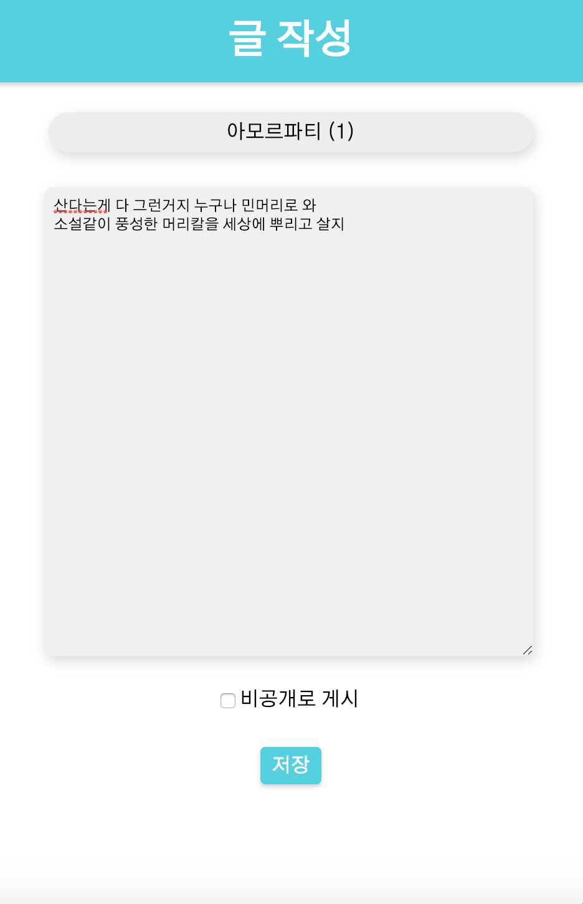
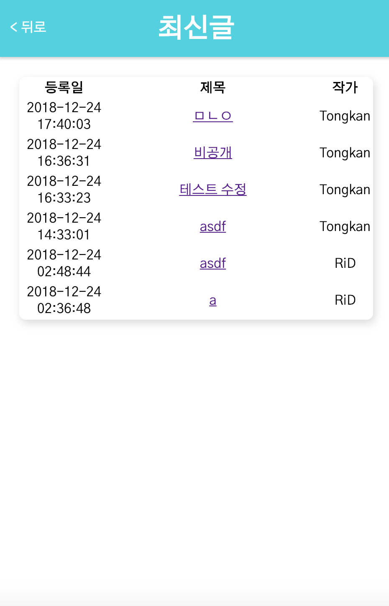
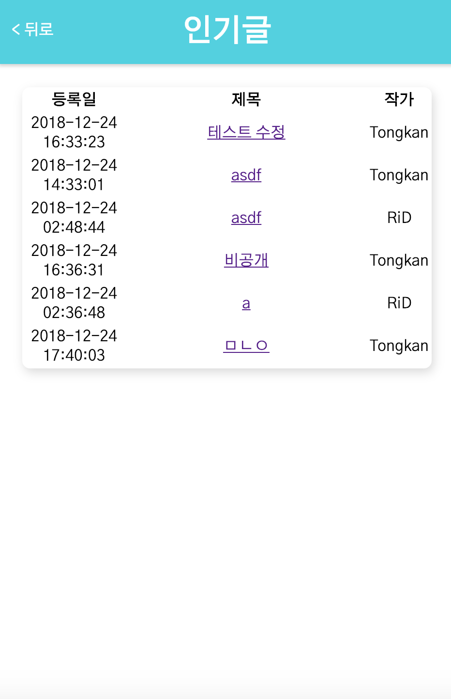

# CowSnow

2018년 2학기 웹프로그래밍 프로젝트

## 배경 및 동기

> ‘내 인생의 주인공은 나다'

누구나 저마다의 소설 같은 이야기를 품고 살아갑니다. 나의 인생에 있어서 나는 가슴 아픈 멜로, 소소한 일상, 박진감 넘치는 액션, 꿈같은 SF 등, 한 편의 소설 속 주인공이 됩니다. CowSnow는 멋진 이야기를 품고 있는 사람이라면 누구나 나의 이야기를 펼쳐 나갈 수 있도록 도와줍니다. 컨텐츠를 소비하는 것을 넘어 생산할 수 있도록, 모두가 베스트 셀러 작가가 되는 세상, CowSnow입니다.

## 개발 내용

CowSnows는 인터넷 소설 연재 플랫폼입니다. 회원가입 없이 다른 작가가500px 작성한 소설을 읽을 수도 있지만, 나만의 이야기를 작성하기 위해서는 회원 가입이 필요합니다. 개발 내용은 다음과 같습니다.

> ###### 개발사양
> * 플랫폼: Web
> * 담당 역할
>   - 개발/ 유지보수
>   - Server 데이터 관리
> * 개발 기술
>   - Java (JSP)
>   - HTML, CSS, JavaScript
>   - Maven
>   - MySQL
> * 서버: Local
> * 서비스 링크
>   - **None**

---

- 메인 화면

  
  
  

---

- 회원 가입 및 로그인
  > 이름, 필명, 이메일, 비밀번호로 구성되어 있으며, 비밀번호는 SHA256으로 암호화되어 해시값이 DB에 저장됩니다. Salt는 무작위로 생성되는 영문자(대문자, 소문자), 숫자, 특수기호의 조합이므로 개인정보 탈취 및 악용이 불가능하도록 대응하였습니다.

  
  

---

- 개인정보 수정

  
  

---

- 글 작성 및 확인
  > 회원가입 후 로그인을 하면 글을 작성할 수 있습니다. 다른 작가가 작성한 글은 회원가입 없이도 볼 수 있습니다. 글을 읽으면 조회수가 1 증가하며, 이 조회수를 기반으로 인기 글을 선정합니다.

  
  

---

- 인기 글, 최신 글 모아보기
  > 메인 화면에서 인기 글과 최신 글을 볼 수 있습니다. Top10까지 표시되며, 인기 글은 조회수를 기반으로, 최신 글은 등록 시간을 기준으로 정렬되어 표시됩니다.

  
  

---

- 댓글
  > 회원가입 후 로그인을 하면 다른 작품에 댓글을 작성할 수 있습니다. 작가는 차기 작품을 기획할 때 이 댓글들을 참고하여 사용할 수 있습니다.

---

## 라이센스

[라이센스 바로 가기](LICENSE.md)

